# FocusFlow 注意力管理系统

<div align="center">
  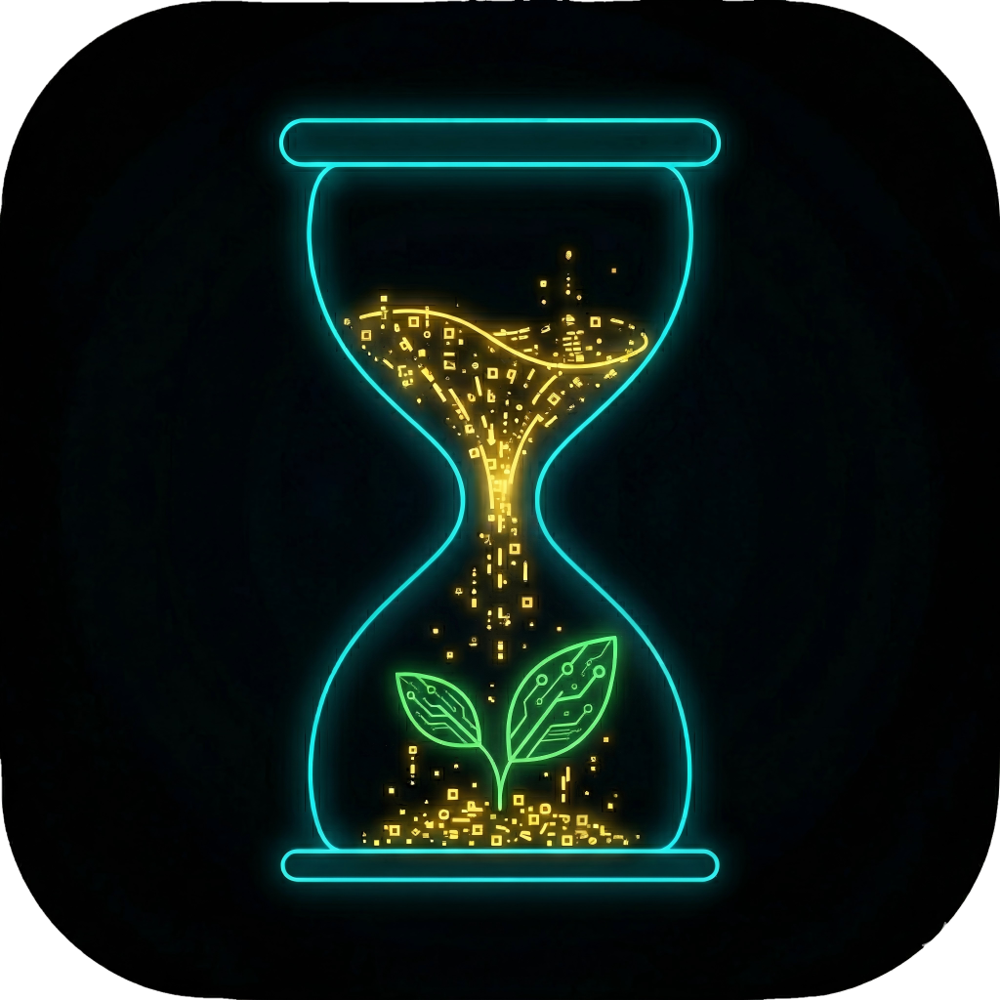


  **专注力培养 × 虚拟植物养成 × AI 助手**

  一款基于番茄工作法的注意力管理 APP，通过虚拟植物养成和 AI 助手，帮助用户建立专注习惯

  [](LICENSE)
  [](https://developer.android.com)
  [](https://spring.io/projects/spring-boot)
  [](https://vuejs.org)
</div>

---

## 📖 项目简介

FocusFlow 是一款创新的注意力管理应用，结合了：

- 🍅 **番茄工作法**：科学的时间管理方法
- 🌱 **虚拟植物养成**：通过专注时长培养虚拟植物，增强成就感
- 🤖 **AI 智能助手**：基于大模型的个性化学习伙伴
- 🔒 **防逃逸机制**：UsageStatsManager + 悬浮窗锁屏，确保专注质量
- ☁️ **本地优先同步**：Room 本地存储 + 云端同步，数据安全可靠

## 🏗️ 技术架构

### 系统架构

```
┌─────────────────────────────────────────────────────────┐
│                    FocusFlow 系统                        │
├─────────────────────────────────────────────────────────┤
│  Android App (Kotlin + Jetpack Compose)                │
│  ├─ Room 本地数据库                                      │
│  ├─ 防逃逸机制 (UsageStatsManager)                      │
│  ├─ 悬浮窗锁屏                                           │
│  └─ SSE 实时通信                                         │
├─────────────────────────────────────────────────────────┤
│  Spring Boot 后端 (Java 17)                             │
│  ├─ RESTful API                                         │
│  ├─ SSE 流式响应                                         │
│  ├─ MyBatis-Plus ORM                                    │
│  └─ 大模型集成 (智谱AI/OpenAI)                          │
├─────────────────────────────────────────────────────────┤
│  Vue 3 管理后台                                          │
│  ├─ Element Plus UI                                     │
│  ├─ ECharts 数据可视化                                   │
│  └─ 浅色主题设计                                         │
├─────────────────────────────────────────────────────────┤
│  MySQL 8.0 数据库                                        │
│  └─ 云端数据持久化                                       │
└─────────────────────────────────────────────────────────┘
```

### 技术栈

| 模块               | 技术栈                          | 版本           |
| ------------------ | ------------------------------- | -------------- |
| **Android 客户端** | Kotlin + Jetpack Compose + Room | 2.0.21 / 2.6.1 |
| **后端服务**       | Spring Boot + MyBatis-Plus      | 3.2.3 / 3.5.5  |
| **管理后台**       | Vue 3 + Vite + Element Plus     | 3.4 / 5.0      |
| **数据库**         | MySQL                           | 8.0            |
| **AI 集成**        | 智谱AI GLM-4 / OpenAI GPT-4     | -              |

## ✨ 核心功能

### 1. 专注模式

- 🎯 **番茄工作法/自定义模式**：25/52 分钟专注时长或自定义
- 🔒 **防逃逸机制**：300ms 轮询检测 + 悬浮窗锁屏
- 📊 **数据统计**：专注时长、连续天数、历史记录

### 2. 虚拟植物养成

- 🌱 **植物状态机**：VIBRANT → WARNING → WITHERED
- 🎨 **多样化植物**：不同稀有度和外观
- 💧 **净化机制**：专注时长转化为植物成长

### 3. AI 智能助手

- 🤖 **个性化对话**：基于大模型的智能交互
- 📝 **Prompt 动态配置**：管理后台实时调整
- 🔄 **SSE 流式响应**：实时打字机效果

### 4. 数据同步

- 💾 **本地优先**：Room 本地存储，离线可用
- ☁️ **云端同步**：联网自动同步到 MySQL
- 🔐 **防篡改签名**：SHA-256 签名验证

### 5. 管理后台

- 📊 **数据可视化**：ECharts 图表展示
- 👥 **用户管理**：批量操作、光流调整
- 🎨 **浅色主题**：Material Design 风格
- 🔧 **AI 配置**：Prompt 管理、熔断开关

## 📁 项目结构

```
FocusFlow/
├── FocusFlow_App/          # Android 客户端
│   ├── app/src/main/
│   │   ├── java/com/example/focusflow/
│   │   │   ├── data/          # Room 数据层
│   │   │   ├── ui/            # Compose UI
│   │   │   ├── service/       # 后台服务
│   │   │   └── utils/         # 工具类
│   │   └── res/               # 资源文件
│   └── build.gradle.kts
│
├── FocusFlow_Server/       # Spring Boot 后端
│   ├── src/main/java/com/focusflow/
│   │   ├── controller/        # REST API
│   │   ├── service/           # 业务逻辑
│   │   ├── mapper/            # MyBatis Mapper
│   │   ├── entity/            # 实体类
│   │   └── config/            # 配置类
│   └── pom.xml
│
├── FocusFlow_Front/        # Vue 3 管理后台
│   ├── src/
│   │   ├── views/             # 页面组件
│   │   ├── components/        # 公共组件
│   │   ├── api/               # API 接口
│   │   ├── styles/            # 样式文件
│   │   └── router/            # 路由配置
│   └── package.json
│
├── DOC/                    # 文档
│   ├── DevLogs_架构与开发日志/  # 开发日志
│   ├── sql/                   # 数据库脚本
│   └── *.docx, *.svg          # 设计文档
│
├── flowcharts/             # 流程图 (Mermaid)
├── 毕业论文/                # 毕业论文相关
└── README.md
```

## 🚀 快速开始

### 环境要求

- **Android 开发**：Android Studio Hedgehog+, JDK 17, Android SDK 26+
- **后端开发**：JDK 17, Maven 3.8+, MySQL 8.0
- **前端开发**：Node.js 18+, npm 9+

### 1. 克隆项目

```bash
git clone https://github.com/your-username/FocusFlow.git
cd FocusFlow
```

### 2. 数据库初始化

```bash
# 连接 MySQL
mysql -u root -p

# 创建数据库
CREATE DATABASE focus_flow CHARACTER SET utf8mb4 COLLATE utf8mb4_unicode_ci;

# 导入表结构
mysql -u root -p focus_flow < DOC/sql/schema.sql

# 导入测试数据（可选）
mysql -u root -p focus_flow < DOC/sql/mock_data_realtime.sql
```

### 3. 启动后端服务

```bash
cd FocusFlow_Server

# 修改配置文件
# 编辑 src/main/resources/application.yml
# 配置数据库连接、AI API Key 等

# 启动服务
mvn spring-boot:run

# 服务运行在 http://localhost:8080/api
```

### 4. 启动管理后台

```bash
cd FocusFlow_Front

# 安装依赖
npm install

# 启动开发服务器
npm run dev

# 访问 http://localhost:3000
# 默认账号：admin / 123456
```

### 5. 构建 Android 应用

```bash
cd FocusFlow_App

# 修改 API 地址
# 编辑 app/build.gradle.kts
# buildConfigField("String", "API_BASE_URL", "\"http://your-server:8080/api/\"")

# 构建 Debug APK
./gradlew assembleDebug

# APK 位置：app/build/outputs/apk/debug/app-debug.apk
```

## 📊 核心功能演示

### APP界面

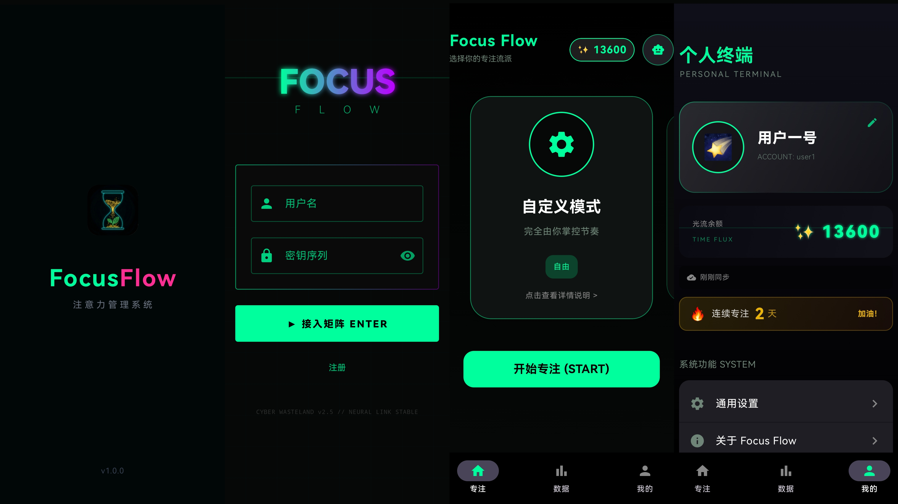

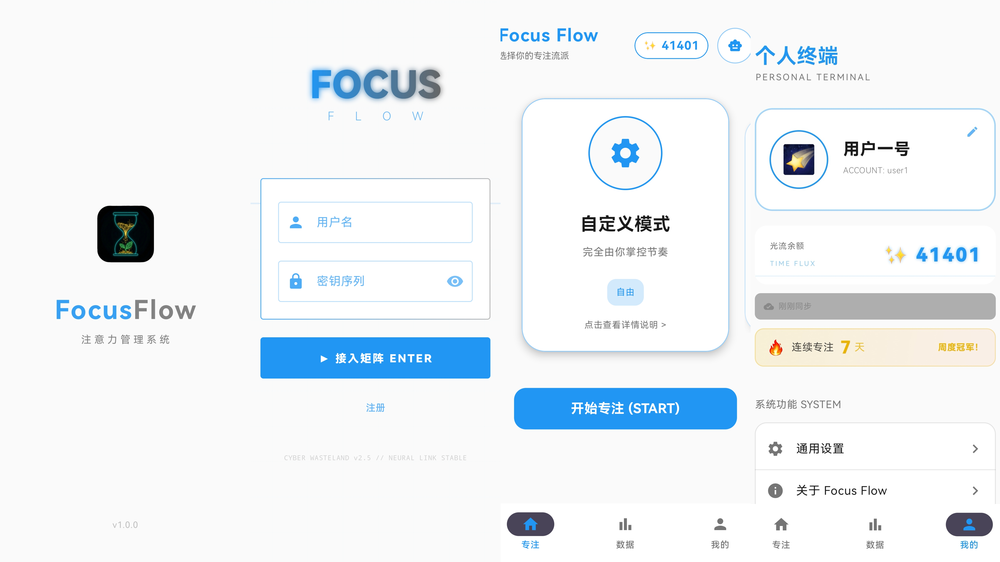

### 数据看板

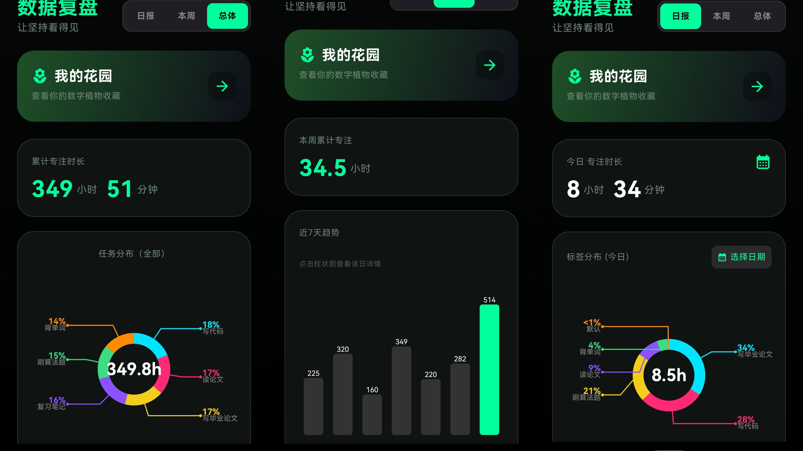

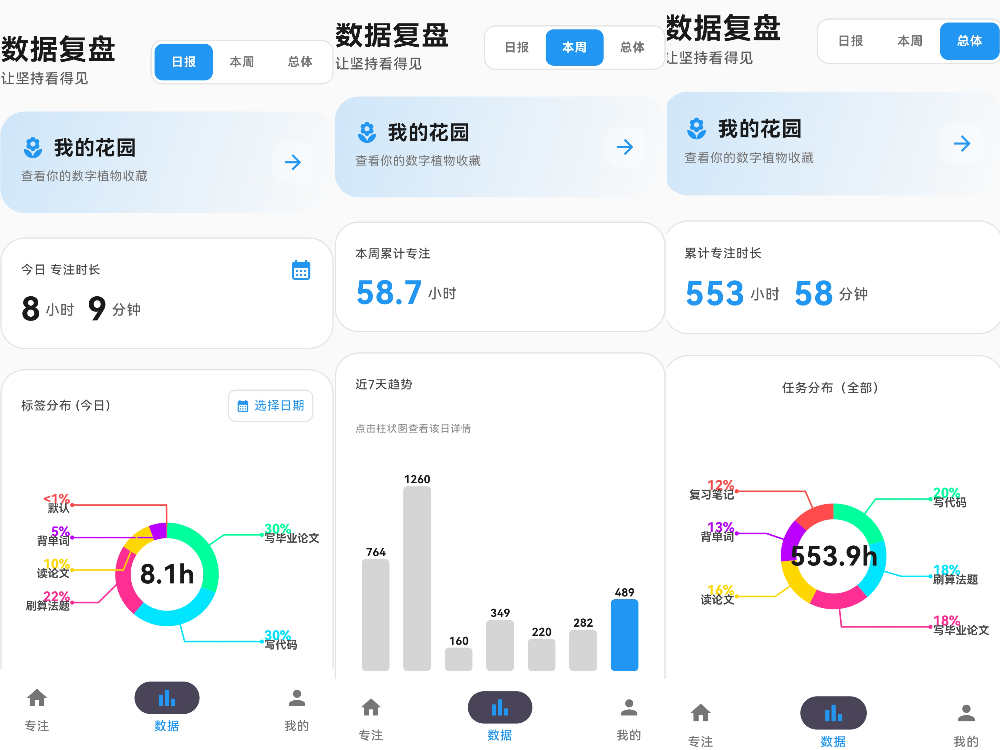

### 专注模式

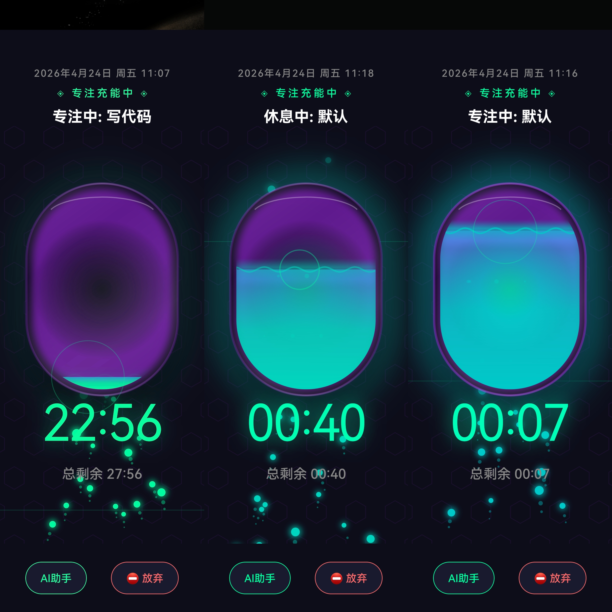

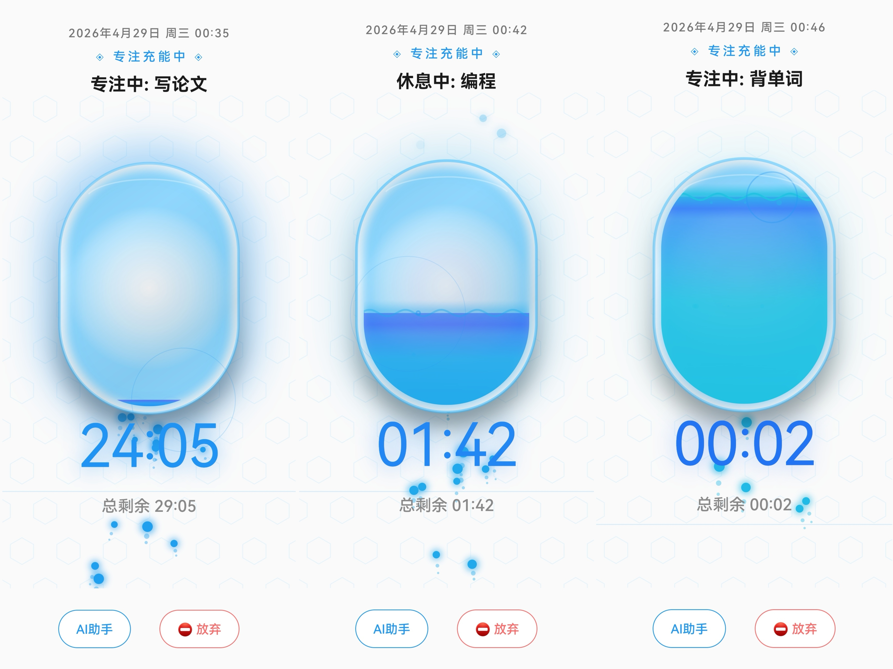

### 植物养成

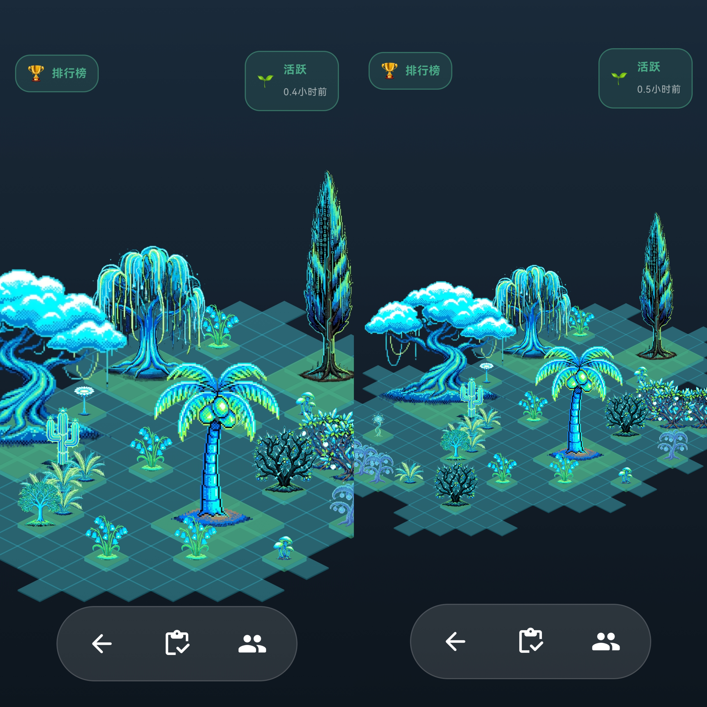

### AI 助手

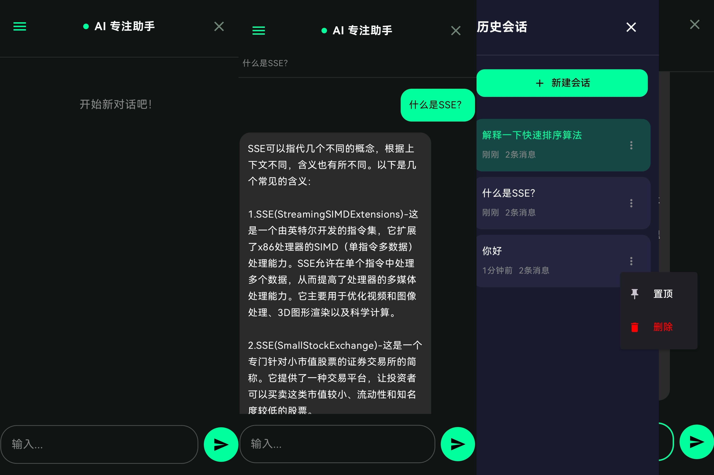

### 社交系统

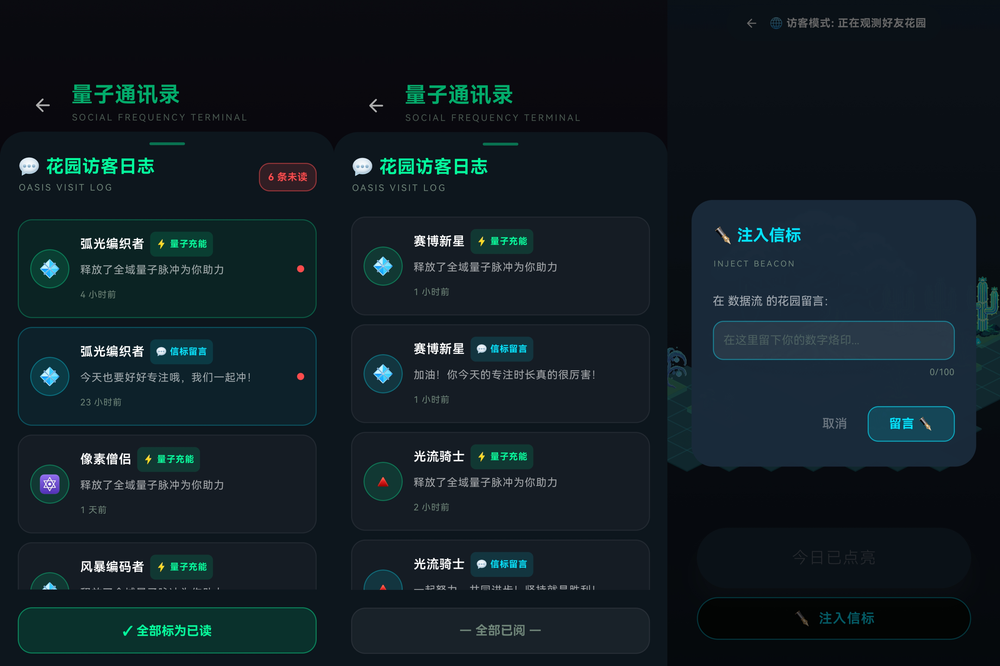

### 管理后台

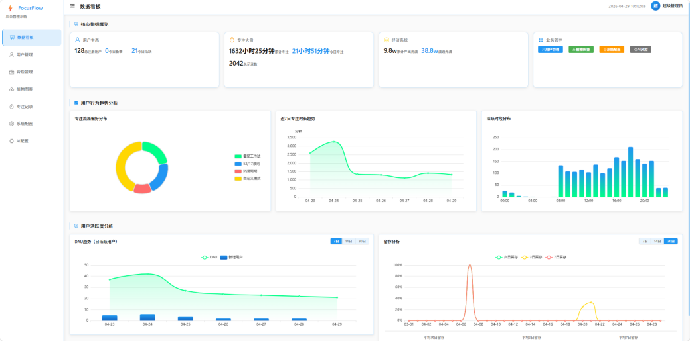

## 📝 开发日志

详细的开发过程记录在 `DOC/DevLogs_架构与开发日志/` 目录下，包括：

- 架构设计决策
- 技术难点解决方案
- 功能迭代记录
- Bug 修复日志

## 🎓 毕业设计

本项目为毕业设计作品，相关论文和文档位于 `毕业论文/` 目录。

## 📄 许可证

本项目采用 MIT 许可证 - 详见 [LICENSE](LICENSE) 文件

## 👨‍💻 作者

**黄子桓**

- 学号：32001192
- 专业：软件工程
- 邮箱：your-email@example.com

## 🙏 致谢

感谢以下开源项目和服务：

- [Jetpack Compose](https://developer.android.com/jetpack/compose)
- [Spring Boot](https://spring.io/projects/spring-boot)
- [Vue.js](https://vuejs.org)
- [Element Plus](https://element-plus.org)
- [智谱AI](https://open.bigmodel.cn)

---

<div align="center">
  Made with ❤️ by 黄子桓


  如果这个项目对你有帮助，请给个 ⭐️ Star！
</div>
