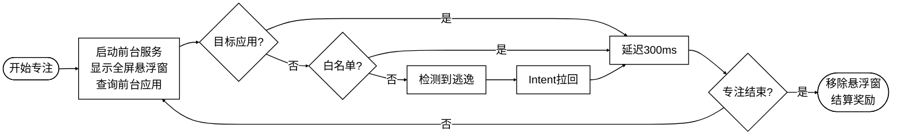
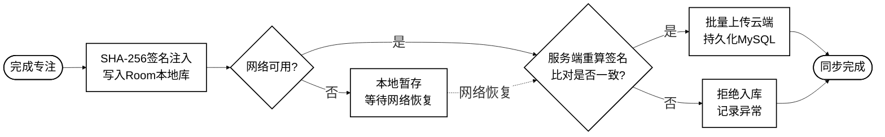
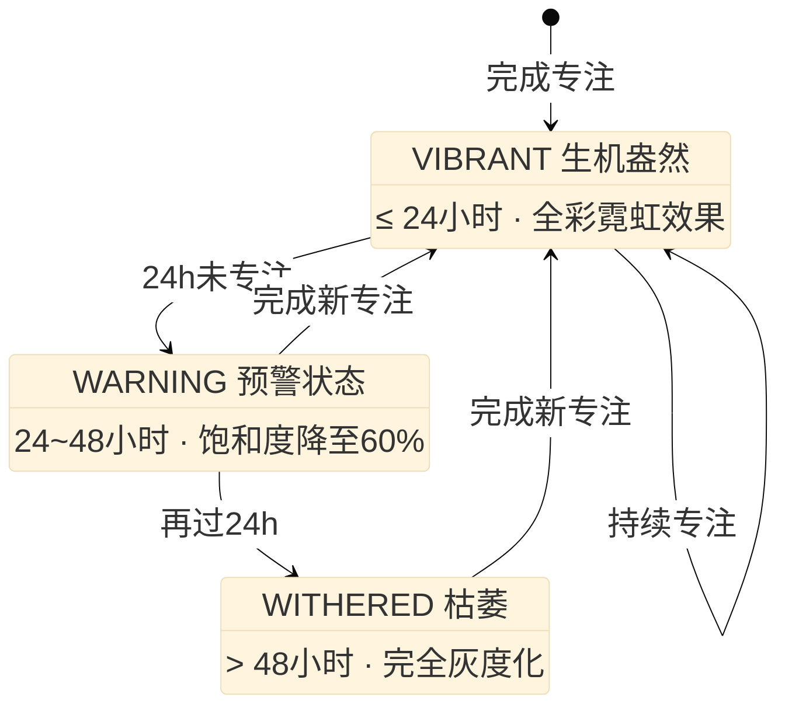

# 流程图2、3、4

---

## 图4.1 UsageStatsWatcher防逃逸轮询流程图

**插入位置**：第4章 4.2节「UsageStatsWatcher高频轮询与防逃逸机制」，紧接在4.2.1节正文"实测表明，从应用切换发生到queryEvents可查询到对应事件的延迟约为50至150毫秒"之后插入。替代原有对轮询步骤的逐条文字描述。



**核心代码**（紧接图4.1之后）：

```kotlin
// UsageStatsWatcher：300ms 高频轮询，检测前台应用切换实现防逃逸
fun startWatching(targetPackage: String) {
    CoroutineScope(Dispatchers.IO + SupervisorJob()).launch {
        while (isActive) {
            val now = System.currentTimeMillis()
            val events = usageStatsManager.queryEvents(now - 300, now)
            var foreground = ""
            while (events.hasNextEvent()) {
                val e = UsageEvents.Event()
                events.getNextEvent(e)
                if (e.eventType == UsageEvents.Event.ACTIVITY_RESUMED)
                    foreground = e.packageName
            }
            // 检测到逃逸：立即通过 Intent 拉回目标应用
            if (foreground.isNotEmpty() && foreground != targetPackage
                    && foreground !in whitelist) {
                context.packageManager
                    .getLaunchIntentForPackage(targetPackage)
                    ?.addFlags(FLAG_ACTIVITY_NEW_TASK or FLAG_ACTIVITY_CLEAR_TOP)
                    ?.let { context.startActivity(it) }
            }
            delay(maxOf(0L, 300 - (System.currentTimeMillis() - now)))
        }
    }
}
```

---

## 图3.x 专注记录端云签名同步流程图

**插入位置**：第3章 3.3.1节「概念结构设计」，紧接在"签名不一致则拒绝入库。此外，计时依据采用CPU运行时间戳而非系统挂钟时间"段落之后，图3.3（E-R图）之前插入。替代对同步流程的逐步文字描述。



**核心代码**（紧接图之后）：

```java
// 服务端 SHA-256 签名验证，防止客户端篡改专注时长
@Transactional(rollbackFor = Exception.class)
public SyncResponse syncRecords(List<FocusRecordDTO> records) {
    int success = 0;
    for (FocusRecordDTO r : records) {
        // 拼接关键字段 + 私钥，重新计算签名并比对
        String content = r.getUuid() + r.getUserId()
            + r.getDuration() + r.getStartTime() + SECRET_KEY;
        if (DigestUtils.sha256Hex(content).equals(r.getSignature())) {
            focusRecordMapper.insert(r);
            success++;
        } else {
            log.warn("签名验证失败，拒绝入库: {}", r.getUuid());
        }
    }
    return new SyncResponse(success, records.size());
}
```

---

## 图5.2 植物惰性衰变状态机流程图

**插入位置**：第5章 5.1.2节「惰性衰变状态机与花园渲染」，紧接在"状态判定逻辑封装在枚举类的伴生对象中，接收上次专注时间戳与当前时间戳作为入参，返回对应的状态枚举值"段落之后，图5.2截图之前插入。替代对三种状态的逐条文字描述。



**核心代码**（紧接图5.2之后）：

```kotlin
// 惰性衰变状态机：仅在渲染时计算，O(N) 复杂度，零后台开销
enum class PlantState { VIBRANT, WARNING, WITHERED;
    companion object {
        fun calculate(lastFocusTime: Long): PlantState {
            val diff = System.currentTimeMillis() - lastFocusTime
            return when {
                diff <= 24 * 3_600_000L -> VIBRANT   // 24h内：全彩
                diff <= 48 * 3_600_000L -> WARNING   // 48h内：饱和度60%
                else                    -> WITHERED  // 超48h：灰度化
            }
        }
    }
}
@Composable
fun PlantItem(plant: Plant) {
    // remember 缓存：lastFocusTime 变化时才重新计算
    val state = remember(plant.lastFocusTime) {
        PlantState.calculate(plant.lastFocusTime)
    }
    when (state) {
        VIBRANT  -> RenderVibrant(plant)
        WARNING  -> RenderWarning(plant)
        WITHERED -> RenderWithered(plant)
    }
}
```
