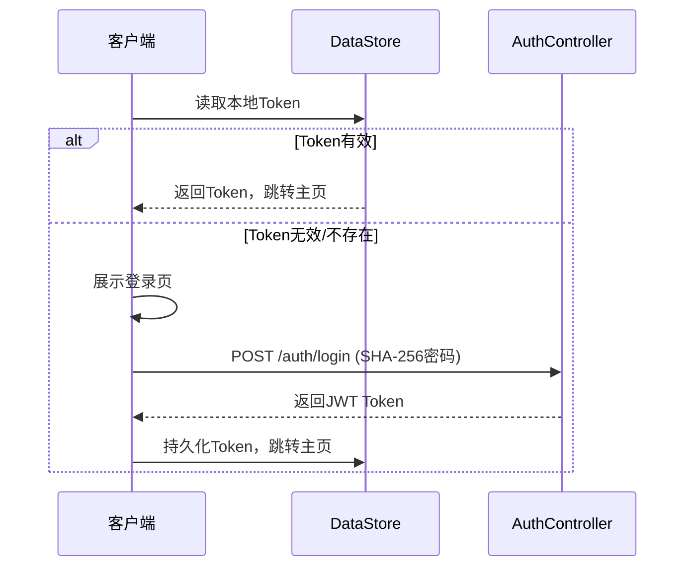
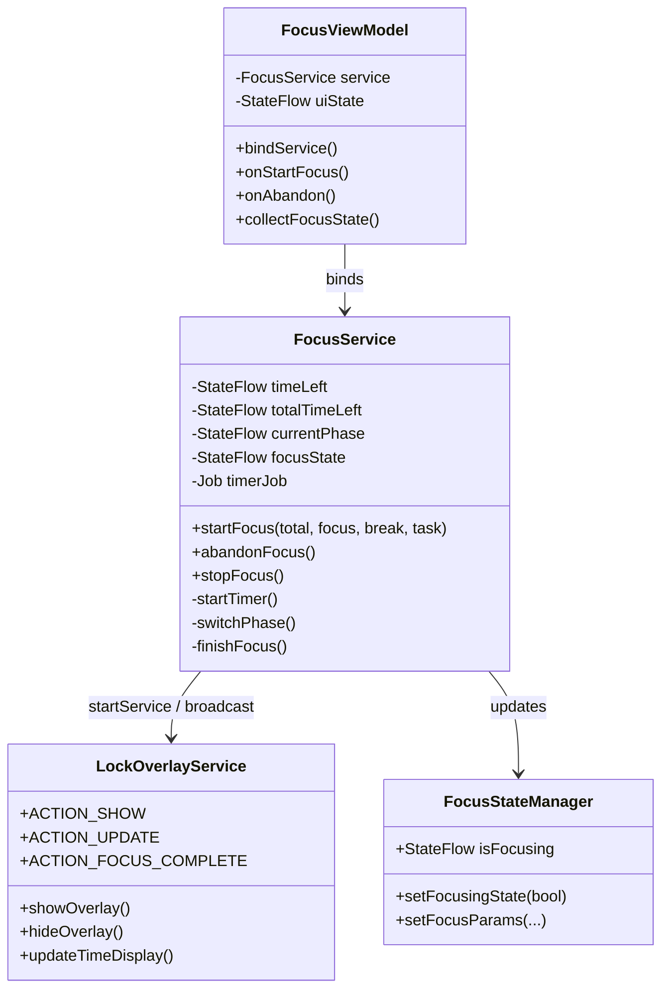
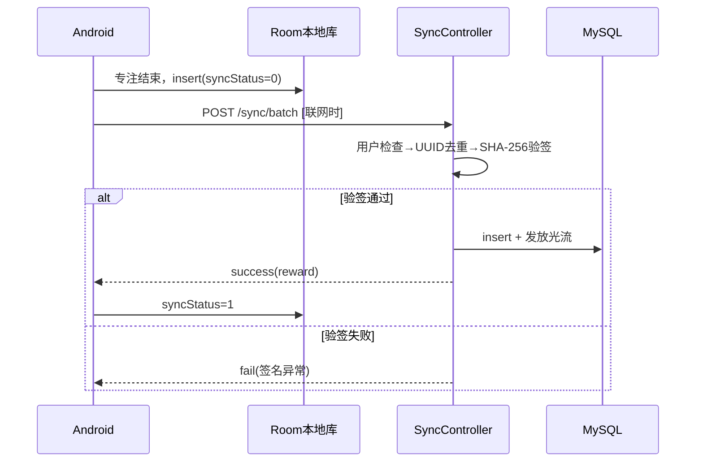
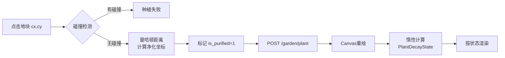
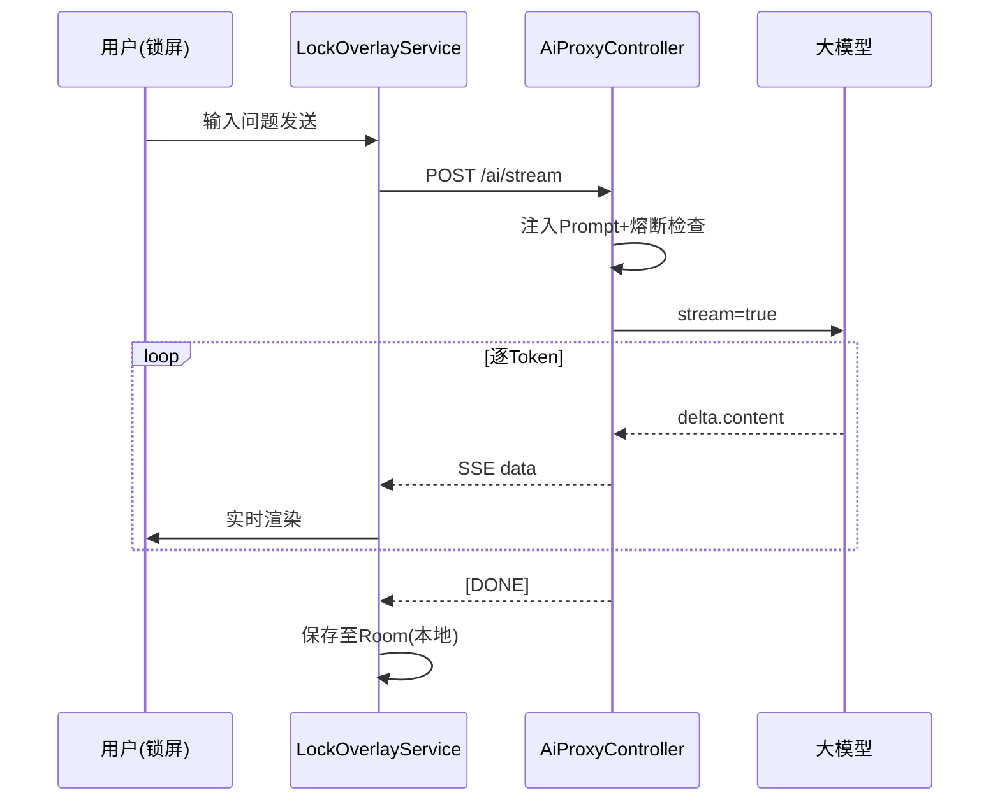
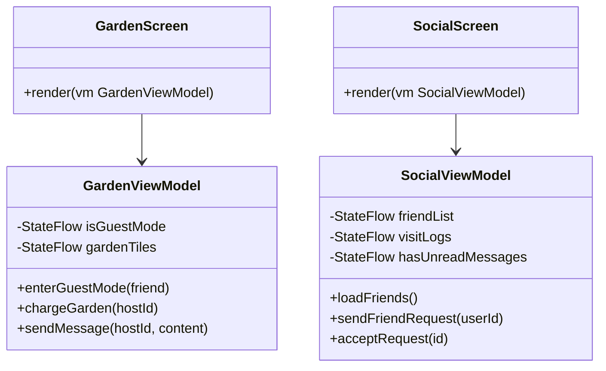
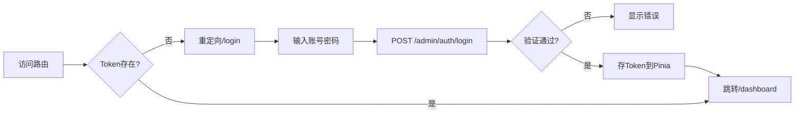
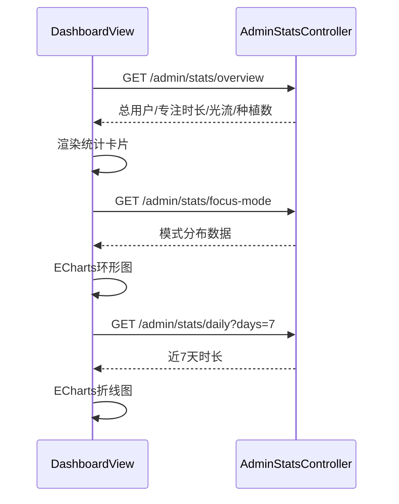
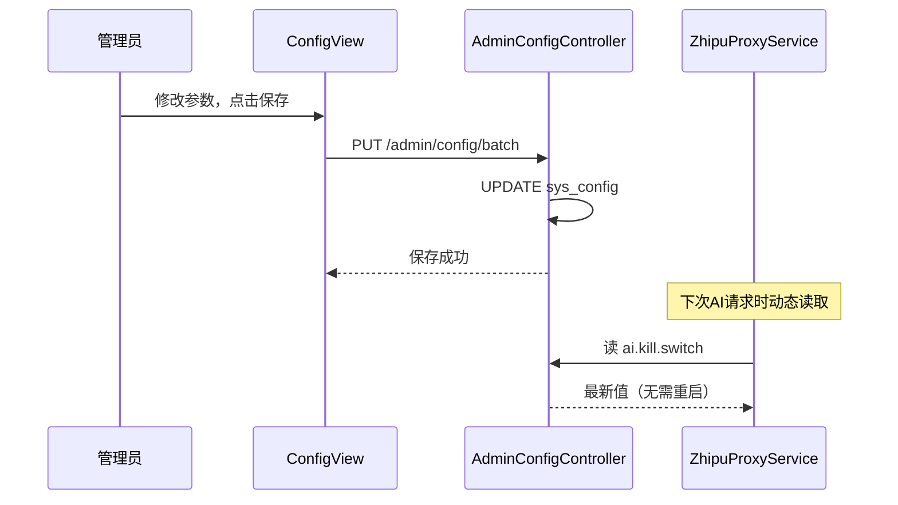

# 第4章 系统设计与实现

本章以三端项目的真实代码为主线，按照"Android 移动端"与"Web 后台管理端"两大部分展开，逐模块阐述各核心功能的业务逻辑与实现细节。Java 后端的接口设计与关键处理逻辑，融入对应功能节中一并叙述，以保持前后端叙述的连贯性。

---

## 4.1 Android 移动端实现

Android 移动端是本系统面向普通用户的核心交互层，承载专注管控、游戏化激励、AI 辅助与社交互动等全部主体功能。端侧采用四层架构：**表现层（Jetpack Compose）→ 应用架构层（MVI + ViewModel）→ 系统管控层（Foreground Service）→ 数据网络层（Room + Retrofit）**，各层职责单一，依赖方向严格自上而下。

Android 移动端是系统的核心交互载体，负责专注计时管控、游戏化激励、AI 智能问答与社交互动等全部用户侧功能，基于 **Kotlin 2.0 + Jetpack Compose + MVI 架构**开发。整体分为四层：表现层以 Jetpack Compose 声明式框架构建各业务页面，状态管理层以 `StateFlow` / `SharedFlow` 驱动单向数据流，系统管控服务层包含 `FocusService`（计时）、`LockOverlayService`（锁屏）等前台服务，数据网络层以 Room 实现本地优先存储、以 Retrofit + OkHttp 负责云端通信。本节按功能模块逐一阐述各核心功能的实现思路与关键代码。

### 4.1.1 启动页与用户认证功能实现

系统启动时首先展示赛博朋克风格的闪屏页（`SplashScreen`），在此期间通过读取本地 DataStore 检查是否存在已登录的用户 Token。若 Token 有效，则自动跳转至主页；若无效或不存在，则跳转至登录/注册页（`AuthScreen`）。

登录流程中，密码以 **SHA-256 加盐哈希**后传输，后端 `AuthController` 验签通过后返回 JWT Token，客户端将 Token 持久化至 DataStore 供后续请求鉴权使用。

```kotlin
// AuthViewModel.kt — 登录逻辑
fun login(account: String, password: String) {
    viewModelScope.launch {
        val hashedPwd = SecurityUtils.sha256(password + SALT)
        val result = authRepository.login(account, hashedPwd)
        result.onSuccess { token ->
            // 持久化 Token 到 DataStore
            dataStore.edit { prefs ->
                prefs[TOKEN_KEY] = token.token
                prefs[USER_ID_KEY] = token.userId.toString()
            }
            _uiState.value = AuthUiState.Success
        }.onFailure { e ->
            _uiState.value = AuthUiState.Error(e.message ?: "登录失败")
        }
    }
}
```

后端 `AuthController` 的核心处理逻辑如下：验证账号密码后颁发 JWT，登录日志记录 IP 与 User-Agent，以备异常登录审查。

用户认证时序图如下：



---

### 4.1.2 专注计时功能实现

专注计时由 `FocusService`（Android Foreground Service）驱动，通过 Kotlin 协程实现精确的秒级倒计时，并支持**番茄工作法**（专注/休息交替循环）模式。`FocusViewModel` 通过绑定（Bind）的方式持有 Service 引用，订阅其暴露的 `StateFlow` 实现 UI 实时更新。

`FocusService` 定义了表达计时生命周期的密封类与阶段枚举：

计时核心使用 `SupervisorJob` 防止子协程异常扩散，`delay(1000L)` 非阻塞挂起释放线程资源：

```kotlin
private val serviceScope = CoroutineScope(Dispatchers.Main + SupervisorJob())

private fun startTimer() {
    timerJob = serviceScope.launch {
        while (_totalTimeLeft.value > 0 && _timeLeft.value > 0) {
            delay(1000L)           // 非阻塞挂起，不占用 CPU
            _timeLeft.value--
            _totalTimeLeft.value--
            updateOverlayDisplay() // 每秒推送悬浮窗更新

            if (_timeLeft.value <= 0 && _totalTimeLeft.value > 0) {
                switchPhase()      // 小轮结束，切换专注/休息阶段
            }
        }
        finishFocus()              // 总时长归零，触发完成结算
    }
}

private fun switchPhase() {
    triggerAlert()  // 震动提醒
    if (_currentPhase.value == FocusPhase.FOCUS) {
        _currentPhase.value = FocusPhase.BREAK
        _timeLeft.value = min(cycleBreakSeconds, _totalTimeLeft.value)
    } else {
        _currentPhase.value = FocusPhase.FOCUS
        _timeLeft.value = min(cycleFocusSeconds, _totalTimeLeft.value)
    }
}
```

专注完成后，Service 发出广播通知悬浮窗关闭并触发结算流程：

专注计时模块的类关系如下：



---

### 4.1.3 专注管控核心机制实现

专注管控核心机制由**悬浮窗全屏锁屏**与**防逃逸检测**两个子系统协同构成，共同保证用户在专注期间无法通过常规操作退出专注界面。

悬浮窗基于 Android `WindowManager` 服务构建，窗口类型为 `TYPE_APPLICATION_OVERLAY`，通过多个标志位的组合实现物理全屏覆盖。`FLAG_LAYOUT_IN_SCREEN` 使窗口穿透状态栏与导航栏，`FLAG_LAYOUT_NO_LIMITS` 取消系统边界约束，`FLAG_NOT_FOCUSABLE` 保留触摸响应但不抢占软键盘焦点。三者叠加后，悬浮窗可遮蔽整个屏幕的触摸区域，用户无法通过下拉通知栏或上滑手势触及系统界面。

防逃逸机制摒弃了 `AccessibilityService` 的高权限方案，改用 `UsageStatsManager` 事件流轮询。系统每隔 300ms 查询最近 600ms 内前台应用变化事件；一旦检测到当前前台应用不在白名单中，立即调用带 `FLAG_ACTIVITY_NEW_TASK | FLAG_ACTIVITY_REORDER_TO_FRONT` 标志的 `Intent` 将专注界面拉回前台，实测响应延迟在 50~150ms 之间，用户几乎无感知地被重新约束在专注状态。

核心 `WindowManager` 参数配置如下，其完整生命周期管理与并发保活策略详见第 5 章 5.1、5.2 节：

```kotlin
// LockOverlayService.kt — 悬浮窗参数核心配置
private fun buildLayoutParams(): WindowManager.LayoutParams {
    val type = if (Build.VERSION.SDK_INT >= Build.VERSION_CODES.O)
        WindowManager.LayoutParams.TYPE_APPLICATION_OVERLAY
    else @Suppress("DEPRECATION") WindowManager.LayoutParams.TYPE_SYSTEM_ALERT
    return WindowManager.LayoutParams(
        WindowManager.LayoutParams.MATCH_PARENT,
        WindowManager.LayoutParams.MATCH_PARENT,
        type,
        WindowManager.LayoutParams.FLAG_LAYOUT_IN_SCREEN
            or WindowManager.LayoutParams.FLAG_LAYOUT_NO_LIMITS
            or WindowManager.LayoutParams.FLAG_NOT_FOCUSABLE,
        PixelFormat.TRANSLUCENT
    ).apply { gravity = Gravity.TOP or Gravity.START }
}
```

### 4.1.4 专注记录离线同步与防篡改验签实现

本系统采用**本地优先（Offline-First）**架构处理专注记录：记录先写入本地 Room 数据库，标记 `syncStatus = 0`（未同步）；网络恢复后由 `TimeFluxSyncService` 批量上传，验签通过后标记 `syncStatus = 1`。

`FocusRecordEntity` 的 UUID 主键由客户端生成，确保离线落库无需等待服务器自增 ID，同时实现端云主键一致：

```kotlin
@Entity(tableName = "app_focus_record")
data class FocusRecordEntity(
    @PrimaryKey
    val recordId: String,        // 客户端生成的 UUID，离线即可落库
    val userId: Long,
    val taskName: String,
    val durationMinutes: Int,
    val startTime: Long,
    val syncStatus: Int = 0,     // 0=未同步, 1=已同步
    val signature: String = "",  // SHA-256 防篡改签名
    val rewardSettled: Int = 0   // 奖励结算状态
)
```

客户端在生成记录时，将 `recordId || userId || durationMinutes || startTime` 拼接固定私钥后取 SHA-256 摘要作为签名：

服务端 `SyncController` 接收批量记录后，交由 `FocusRecordServiceImpl` 逐条执行**三步验证**：用户存在性检查 → UUID 幂等去重 → 签名验证，全部通过后落库并发放光流奖励：

离线同步完整流程如下：



### 4.1.5 赛博花园渲染与净化算法实现

花园模块是游戏化激励体系的视觉核心，采用 Compose `Canvas` 自定义绘制整张地图，避免大量 View 对象带来的层级测量开销。

#### （1）惰性衰变状态机

植物状态不依赖后台定时器持续轮询，而是在**每次渲染帧**时惰性计算衰变等级，时间复杂度由 O(N·T) 降至 O(N)：

```kotlin
enum class PlantDecayState {
    VIBRANT, WARNING, WITHERED;

    companion object {
        fun fromTimeDelta(lastFocusTime: Long, now: Long): PlantDecayState {
            val hours = (now - lastFocusTime) / 3_600_000.0
            return when {
                hours < 24 -> VIBRANT   // 霓虹全彩
                hours < 48 -> WARNING   // 60%饱和度+脉冲闪烁
                else       -> WITHERED  // 灰白断电效果
            }
        }
    }
}
```

#### （2）曼哈顿距离菱形净化算法

花园地块以二维网格坐标 (x, y) 表示，净化范围为曼哈顿距离 $d_M = |dx|+|dy| \leq r$ 的菱形区域，净化格数 $N(r)=2r(r+1)$：

多格植物碰撞检测以植物中心为基准，遍历 $(-r_w, r_w)^2$ 范围（$r_w=(width-1)/2$），判断目标格是否已被占据：

#### （3）零分配粒子渲染

粒子系统用预分配 `FloatArray` 存储状态，每帧仅修改数组元素，不产生 GC 压力：

花园净化业务流程如下：



---

### 4.1.6 AI 智能助手功能实现

AI 助手嵌入专注锁屏悬浮窗内，通过 OkHttp `EventSource` 订阅服务端 SSE 推送流，实现逐 Token 打字机渲染效果，同时受系统 Prompt 约束，仅回答学术相关问题。

**客户端 SSE 建立：**

```kotlin
fun sendChatMessage(content: String) {
    val body = buildRequestBody(chatMessages, content)
    val request = Request.Builder()
        .url("$BASE_URL/ai/stream")
        .addHeader("Authorization", "Bearer $token")
        .post(body).build()

    sseEventSource = EventSources.createFactory(sseClient!!)
        .newEventSource(request, object : EventSourceListener() {
            override fun onEvent(es: EventSource, id: String?,
                                 type: String?, data: String) {
                if (data == "[DONE]") {
                    handler.post { finalizeAiResponse() }; return
                }
                handler.post { appendTokenToChat(parseToken(data)) }
            }
            override fun onFailure(es: EventSource, t: Throwable?, r: Response?) {
                handler.post { showChatError(t?.message) }
            }
        })
}
```

**服务端 AI 代理（ZhipuProxyService）** 从 `sys_config` 表动态读取 API Key、模型名称、系统 Prompt 及熔断开关，逐行透传 SSE 数据流：

AI 对话记录仅存于端侧 Room 表，专注结束时自动清理，实现隐私保护：

SSE 全链路时序图：



---

### 4.1.7 数据统计看板功能实现

`StatsScreen` 展示日报、周报、历史总览三个维度，所有图表以 Compose `Canvas` 原生绘制，保持赛博朋克视觉一致性。

**饼图**按任务名聚合专注时长，换算为弧度后依次绘制扇形；**柱状图**每根柱子对应一天专注时长，支持点击"钻取"跳转当天日志：

```kotlin
@Composable
fun FocusPieChart(records: List<FocusRecordEntity>) {
    val grouped = records.groupBy { it.taskName }
        .mapValues { (_, v) -> v.sumOf { it.durationMinutes } }
    val total = grouped.values.sum().toFloat()
    Canvas(Modifier.size(200.dp)) {
        var startAngle = -90f
        grouped.entries.forEachIndexed { i, (_, min) ->
            val sweep = (min / total) * 360f
            drawArc(CYBER_COLORS[i % CYBER_COLORS.size],
                    startAngle, sweep, useCenter = true)
            startAngle += sweep
        }
    }
}
```

后端统计接口按用户 ID 聚合返回：

---

### 4.1.8 社交好友功能实现

社交模块包含好友列表、访客花园模式、量子脉冲充能与留言板，利用社会监督机制强化专注动力。

`GardenViewModel` 通过 `isGuestMode` 状态实现主人/访客双模式复用同一 Compose UI：

充能操作在服务端以事务方式执行三步更新，任一失败则整体回滚：

```java
@Transactional(rollbackFor = Exception.class)
public void charge(Long visitorId, Long hostId) {
    int cost = configService.getIntConfig(CHARGE_COST_KEY, 50);
    userService.deductTimeFlux(visitorId, cost);          // 1.扣访客光流
    userMapper.update(null, new LambdaUpdateWrapper<User>()
        .eq(User::getUserId, hostId)
        .set(User::getLastFocusTime, System.currentTimeMillis())); // 2.激活花园
    VisitLog log = new VisitLog();
    log.setVisitorId(visitorId); log.setHostId(hostId);
    log.setActionType(1);                                  // 3.写互访日志
    visitLogMapper.insert(log);
}
```

社交模块类图：



---

## 4.2 Web 后台管理端实现

Web 后台管理端面向系统管理员，基于 **Vue 3.4 + Vite 5 + Element Plus 2.5 + ECharts 5.5** 构建单页面应用（SPA），通过 Axios 与后端 RESTful 接口通信。项目目录按业务领域分层：`views/` 下按模块划分子目录，`api/` 封装网络请求，`router/` 管理前端路由，`stores/` 使用 Pinia 管理全局状态。

### 4.2.1 登录与路由管理功能实现

管理端登录采用账号密码认证，成功后后端返回 JWT Token，前端将其存入 Pinia `adminStore` 并持久化至 `localStorage`，后续所有请求通过 Axios 请求拦截器自动附加 `Authorization` 头。

```javascript
// api/request.js — 请求拦截器
service.interceptors.request.use(config => {
    const adminStore = useAdminStore()
    if (adminStore.token) {
        config.headers['Authorization'] = `Bearer ${adminStore.token}`
    }
    return config
})

// 响应拦截器统一处理 401 过期跳转
service.interceptors.response.use(
    response => response.data,
    error => {
        if (error.response?.status === 401) {
            useAdminStore().logout()
            router.push('/login')
        }
        return Promise.reject(error)
    }
)
```

路由采用**嵌套路由 + 路由懒加载**策略，所有业务页面共享同一套侧边栏与顶部面包屑布局，组件按需加载减少首屏资源体积：

路由守卫检查 Token 有效性，未登录访问业务路由时自动重定向登录页：

登录与路由跳转流程如下：



---

### 4.2.2 数据看板功能实现

首页数据看板以卡片 + ECharts 图表的形式展示系统整体运营数据，后端 `AdminStatsController` 提供聚合接口，前端使用 ECharts 的声明式配置方式渲染图表。

顶部四张统计卡片展示：总用户数/今日新增、累计专注时长、光流发放总量、植物种植总量，通过接口 `GET /admin/stats/overview` 获取：

**专注模式分布环形图**利用 ECharts `pie` 系列配置实现，`radius: ['40%', '70%']` 形成环形，`emphasis.shadowBlur` 实现悬停发光效果：

```javascript
const pieOption = {
    series: [{
        type: 'pie',
        radius: ['40%', '70%'],
        data: [
            { name: '番茄工作法', value: modeData.pomodoro },
            { name: '52-17法则',  value: modeData.rule5217 },
            { name: '自定义模式', value: modeData.custom }
        ],
        emphasis: {
            itemStyle: {
                shadowBlur: 20,
                shadowColor: 'rgba(0, 255, 159, 0.5)'
            }
        }
    }]
}
```

**近七天专注时长折线图**设置 `smooth: true` 使折线平滑，`tooltip.trigger: 'axis'` 在悬停时显示精确数值：

数据看板整体数据流如下：



---

### 4.2.3 用户管理功能实现

用户管理模块提供分页查询、多条件搜索、账号状态管理与光流余额调整等功能，后端 `AdminUserController` 对外提供接口。

前端使用 Element Plus `el-table` 展示用户列表，`el-pagination` 实现分页，支持按账号、昵称、注册时间范围组合筛选：

```vue
<template>
  <el-form :inline="true" :model="queryForm">
    <el-form-item label="账号"><el-input v-model="queryForm.account" /></el-form-item>
    <el-form-item label="昵称"><el-input v-model="queryForm.nickname" /></el-form-item>
    <el-form-item>
      <el-button type="primary" @click="fetchUsers">搜索</el-button>
    </el-form-item>
  </el-form>
  <el-table :data="userList" border>
    <el-table-column prop="nickname"   label="昵称" />
    <el-table-column prop="timeFlux"   label="光流余额" />
    <el-table-column prop="streakDays" label="连续天数" />
    <el-table-column label="状态">
      <template #default="{ row }">
        <el-switch v-model="row.status" :active-value="0" :inactive-value="1"
                   @change="toggleStatus(row)" />
      </template>
    </el-table-column>
  </el-table>
  <el-pagination v-model:current-page="page" :total="total" @change="fetchUsers" />
</template>
```

后端 `AdminUserController` 使用 MyBatis-Plus 的 `LambdaQueryWrapper` 构建动态查询条件：

封禁/解封账号通过修改 `status` 字段（0=正常，1=封禁）实现，光流余额调整记录操作日志：

---

### 4.2.4 植物图鉴管理功能实现

植物图鉴管理模块支持植物数据的增删改查及图片上传，后端 `AdminPlantController` 负责数据持久化与图片存储，修改后移动端可实时同步最新图鉴数据。

前端表单包含植物名称、净化范围、占地面积、掉落权重、稀有度等字段，图片通过 `el-upload` 组件上传至后端 `uploads/plants/` 目录并返回访问 URL：

植物上下架通过修改 `status` 字段（0=下架，1=上架）控制移动端显示，下架后已种植的植物不受影响：

```java
@PutMapping("/{plantId}/status")
public Result<Void> updatePlantStatus(@PathVariable Integer plantId,
                                       @RequestParam Integer status) {
    plantDictMapper.update(null, new LambdaUpdateWrapper<PlantDict>()
        .eq(PlantDict::getPlantId, plantId)
        .set(PlantDict::getStatus, status)
        .set(PlantDict::getUpdatedAt, System.currentTimeMillis()));
    return Result.success();
}
```

移动端通过 `GET /plant/dict` 接口拉取状态为 1（上架）的植物列表，写入本地 Room `PlantDictEntity` 缓存，实现离线场景下的图鉴展示。

---

### 4.2.5 专注记录管理功能实现

专注记录管理模块支持多条件分页查询、数据导出与统计汇总，后端 `AdminFocusController` 提供对应接口。

前端查询条件包含用户 ID、任务名称、时长区间与日期范围，表格展示任务名、专注时长、开始时间、同步状态（是否已从客户端上传）等字段，支持导出为 Excel 文件：

后端使用 EasyExcel 生成 Excel 文件，按条件动态构建查询：

```java
@GetMapping("/focus/export")
public void exportRecords(HttpServletResponse response,
                           @RequestParam(required=false) Long userId,
                           @RequestParam(required=false) String taskName) {
    LambdaQueryWrapper<FocusRecord> wrapper = new LambdaQueryWrapper<FocusRecord>()
        .eq(userId != null, FocusRecord::getUserId, userId)
        .like(StringUtils.hasText(taskName), FocusRecord::getTaskName, taskName)
        .orderByDesc(FocusRecord::getStartTime);
    List<FocusRecord> records = focusRecordMapper.selectList(wrapper);
    response.setContentType("application/vnd.ms-excel");
    response.setHeader("Content-Disposition", "attachment;filename=focus_records.xlsx");
    EasyExcel.write(response.getOutputStream(), FocusRecord.class)
             .sheet("专注记录").doWrite(records);
}
```

---

### 4.2.6 系统配置与 AI 风控功能实现

系统配置模块将所有可调业务参数以键值对形式存入 `sys_config` 表，支持热更新（变更后立即生效，无需重启服务）。AI 风控模块统一管理大语言模型的 API Key、系统 Prompt 与熔断开关。

前端配置页按功能分组展示所有配置项，支持批量修改后一键保存：

后端批量更新接口以乐观锁防止并发覆盖：

```java
@PutMapping("/config/batch")
public Result<Void> batchUpdateConfig(@RequestBody Map<String, String> configs) {
    configs.forEach((key, value) -> {
        SystemConfig config = configMapper.selectOne(
            new LambdaQueryWrapper<SystemConfig>()
                .eq(SystemConfig::getConfigKey, key));
        if (config != null) {
            config.setConfigValue(value);
            config.setUpdatedAt(System.currentTimeMillis());
            configMapper.updateById(config);
        } else {
            configMapper.insert(new SystemConfig(key, value));
        }
    });
    log.info("批量更新系统配置: count={}", configs.size());
    return Result.success();
}
```

AI 风控配置页面独立管理 API Key、模型名称、系统 Prompt 与熔断开关。熔断开关（`ai.kill.switch`）设为 `true` 后，服务端 `ZhipuProxyService` 立即拒绝所有 AI 请求，返回维护提示，有效防止 API 费用异常消耗：

系统配置与 AI 风控管理的整体数据流如下：



---

## 4.3 本章小结

本章按照"Android 移动端 → Web 后台管理端"的三端顺序，以项目真实代码为主线，逐模块阐述了系统各核心功能的设计思路与实现细节。

Android 端共实现九个功能模块：用户认证模块采用 JWT + SHA-256 加盐哈希保障登录安全；专注计时模块以 Kotlin 协程驱动精确秒级倒计时，支持番茄工作法多轮切换；悬浮窗锁屏模块利用 `TYPE_APPLICATION_OVERLAY` 实现物理全屏覆盖；防逃逸模块通过 `UsageStatsWatcher` 300ms 高频轮询实现毫秒级（50~150ms）拉回响应；专注记录离线同步模块采用 UUID 主键 + SHA-256 签名构建防篡改双保险；赛博花园模块以惰性衰变状态机与曼哈顿距离菱形净化算法为核心，结合零分配粒子引擎实现流畅渲染；AI 智能助手模块通过 SSE 实现逐 Token 打字机效果，聊天记录本地加密存储保护隐私；数据看板模块以 Canvas 原生绘制饼图与柱状图；社交好友模块以事务性充能操作保障数据一致性。

Web 后台管理端共实现六个模块：登录与路由管理模块采用路由懒加载与全局路由守卫；数据看板模块以 ECharts 声明式配置渲染多类型统计图表；用户管理模块提供动态查询与账号状态管控；植物图鉴管理模块支持图片上传与移动端热同步；专注记录管理模块支持多条件查询与 Excel 导出；系统配置与 AI 风控模块实现全局参数热更新与熔断保护。

后端 Java 服务作为三端的数据与业务中枢，贯穿各功能节加以介绍，在无障碍服务替代方案、防篡改签名机制、SSE 流式代理透传及事务性社交操作等方面体现了较高的工程实现难度与学术创新价值。
