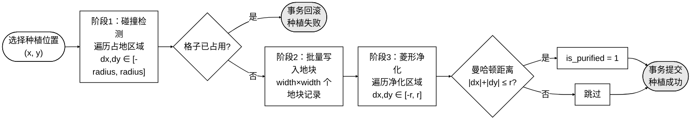
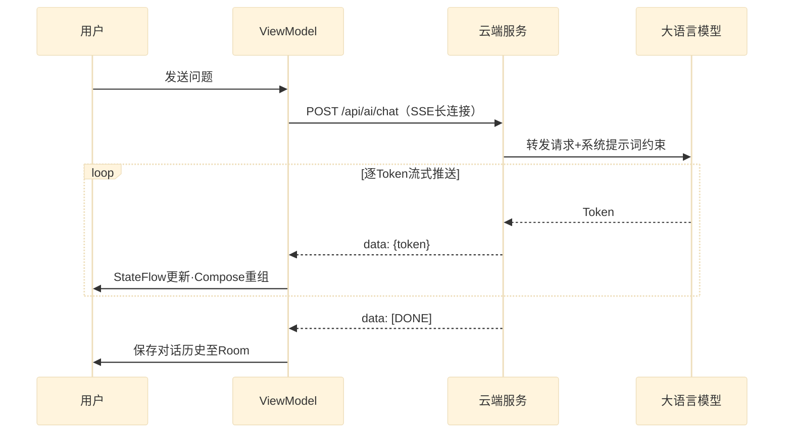
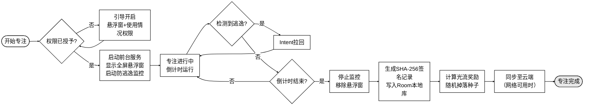
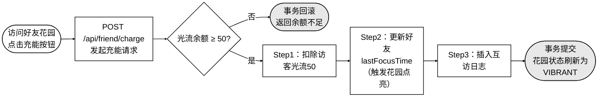

# 流程图5、6、7、8

---

## 图5.x 菱形净化与多格碰撞检测流程图

**插入位置**：第5章 5.1.4节「基于曼哈顿距离的菱形净化与多格碰撞检测」，紧接在"种植流程采用'先检后写'两阶段策略……整个流程包裹在@Transactional事务注解中，确保碰撞检测与地块写入的原子性"段落之后插入。替代对三阶段流程的逐步文字描述。



**核心代码**（紧接图之后）：

```java
// plantSeed：三阶段事务 —— 碰撞检测 → 写入地块 → 菱形净化
@Transactional(rollbackFor = Exception.class)
public void plantSeed(Long userId, Long bagItemId, Integer x, Integer y) {
    PlantDict plant = plantDictMapper.selectById(
        userBagMapper.selectById(bagItemId).getPlantId());
    int radius = (plant.getWidth() - 1) / 2;
    // 阶段1：碰撞检测，任一格子被占则抛出异常触发回滚
    for (int dx = -radius; dx <= radius; dx++)
        for (int dy = -radius; dy <= radius; dy++)
            if (gardenTileMapper.isOccupied(userId, x + dx, y + dy))
                throw new RuntimeException("该位置已被占用");
    // 阶段2：批量写入占地地块
    for (int dx = -radius; dx <= radius; dx++)
        for (int dy = -radius; dy <= radius; dy++)
            gardenTileMapper.insert(buildTile(userId, x + dx, y + dy, plant));
    // 阶段3：菱形净化 —— 曼哈顿距离 ≤ purifyRange 的格子标记为已净化
    int r = plant.getPurifyRange();
    for (int dx = -r; dx <= r; dx++)
        for (int dy = -r; dy <= r; dy++)
            if (Math.abs(dx) + Math.abs(dy) <= r)
                gardenTileMapper.setPurified(userId, x + dx, y + dy);
}
```

---

## 图5.x SSE流式响应逐Token推送时序图

**插入位置**：第5章 5.3.2节「SSE流式响应处理」，紧接在"服务端通过HTTP长连接持续推送增量Token，客户端实时接收并渲染，实现'打字机'式的逐字输出效果"段落之后，图5.9截图之前插入。替代对SSE事件格式和客户端处理流程的逐步文字描述。



**核心代码**（紧接图之后）：

```kotlin
// SSE 流式响应：IO 协程逐行读取，StateFlow 实时驱动 Compose 重组（打字机效果）
withContext(Dispatchers.IO) {
    val reader = BufferedReader(
        InputStreamReader(response.body()!!.byteStream()))
    val buffer = StringBuilder()
    var line: String?
    while (reader.readLine().also { line = it } != null) {
        if (!line!!.startsWith("data: ")) continue
        val data = line!!.removePrefix("data: ")
        if (data == "[DONE]") break
        gson.fromJson(data, Chunk::class.java)
            ?.choices?.firstOrNull()?.delta?.content
            ?.let { token ->
                buffer.append(token)
                withContext(Dispatchers.Main) {
                    _streamingText.value = buffer.toString()
                }
            }
    }
    chatDao.insertMessage(ChatMessageEntity(buffer.toString(), isUser = false))
}
```

---

## 图3.x 用户专注全流程业务流程图

**插入位置**：第3章 3.2.1节「Android移动端需求」，紧接在"游戏化激励需求要求系统将专注行为转化为虚拟资产收益……形成正向激励闭环"段落之后插入。作为对三大需求模块（强效专注管控、受限AI对话、游戏化激励）的整体流程总结，替代各需求的逐条文字描述。



**核心代码**（紧接图之后）：

```kotlin
// FocusService：专注完成后的结算与本地优先同步
private fun handleFocusComplete(durationSeconds: Long, taskName: String) {
    usageStatsWatcher.stopWatching()
    val record = FocusRecord(
        recordId        = UUID.randomUUID().toString(),
        userId          = SessionManager.getUserId(),
        taskName        = taskName,
        durationMinutes = (durationSeconds / 60).toInt(),
        startTime       = System.currentTimeMillis() - durationSeconds * 1000,
        signature       = SecurityUtils.sign(recordId, userId, durationMinutes, startTime)
    )
    CoroutineScope(Dispatchers.IO).launch {
        focusRecordDao.insert(record)                        // 本地优先写入
        userDao.addFlux(record.userId,
            record.durationMinutes * REWARD_PER_MINUTE)     // 发放光流奖励
        if (NetworkUtils.isAvailable()) syncToCloud(record) // 网络可用则同步
    }
    stopForeground(true); stopSelf()
}
```

---

## 图5.x 量子脉冲充能多表事务流程图

**插入位置**：第5章 5.4.2节「量子脉冲充能机制」，紧接在"三个操作必须作为原子事务执行，任一操作失败则全部回滚，确保数据一致性"段落之后，图5.11截图之前插入。替代对三步事务操作的逐条文字描述。



**核心代码**（紧接图之后）：

```java
// chargeGarden：三步原子事务，任一失败全部回滚
@Transactional(rollbackFor = Exception.class)
public void chargeGarden(Long visitorId, Long friendId) {
    User visitor = userMapper.selectById(visitorId);
    int cost = configService.getInt(CHARGE_FLUX_COST, 50);
    if (visitor.getTimeFlux() < cost)
        throw new BusinessException("光流余额不足");
    // Step1：扣除访客光流
    userMapper.update(null, new LambdaUpdateWrapper<User>()
        .eq(User::getUserId, visitorId)
        .setSql("time_flux = time_flux - " + cost));
    // Step2：更新好友 lastFocusTime（触发花园点亮效果）
    userMapper.update(null, new LambdaUpdateWrapper<User>()
        .eq(User::getUserId, friendId)
        .set(User::getLastFocusTime, System.currentTimeMillis()));
    // Step3：记录互访日志
    visitLogMapper.insert(
        new VisitLog(visitorId, friendId, ACTION_CHARGE, cost));
}
```
